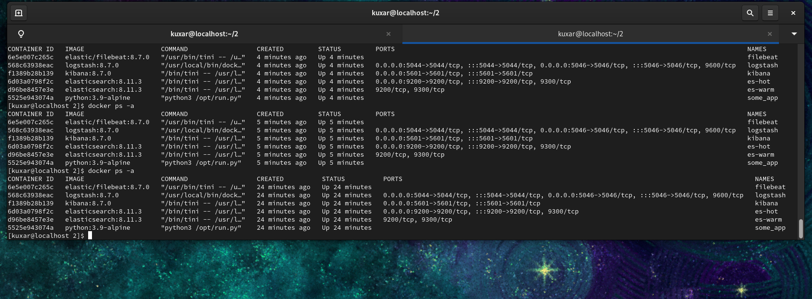
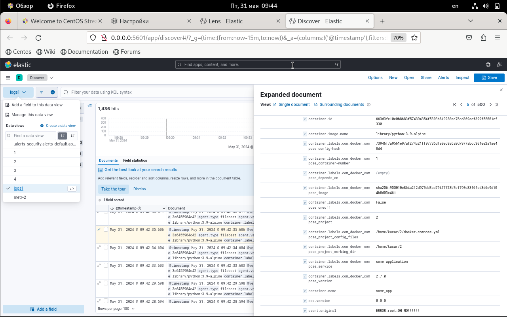

# monitoring-04-elk
#
1. Успешно развернул контейнеры из директории help и изменил версии устанавливаемых сервисов.
 

#
2.
Cоздал несколько разных индексов, нашел иветы с запущенным приложением

#